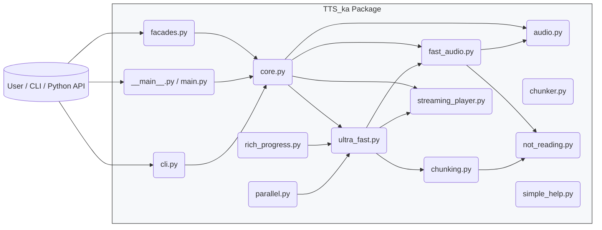
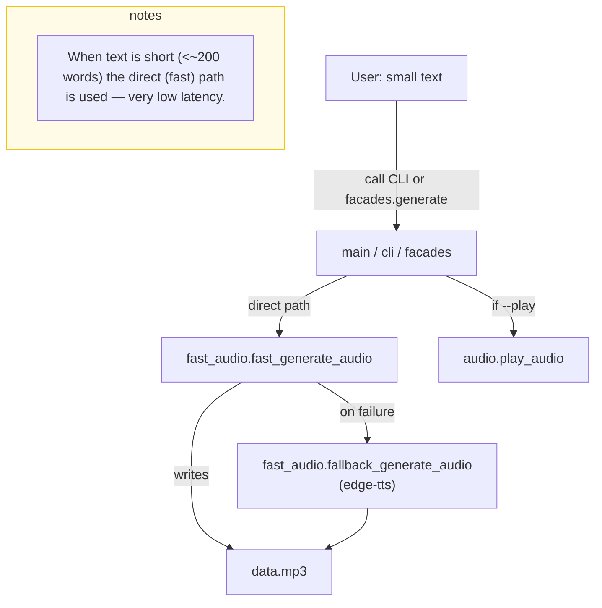
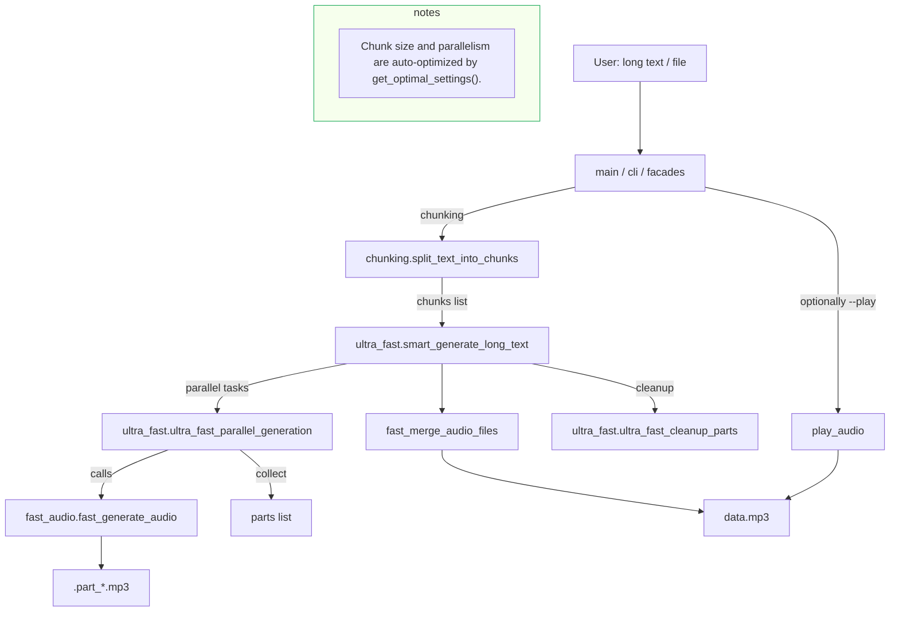
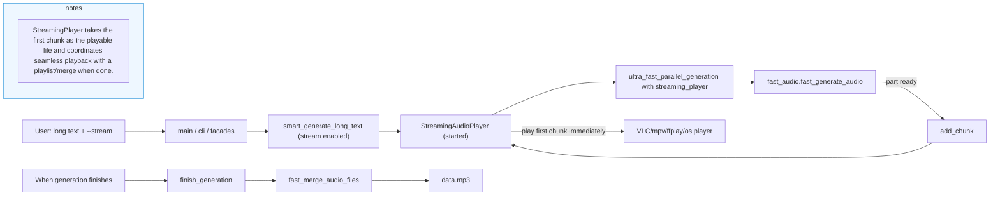
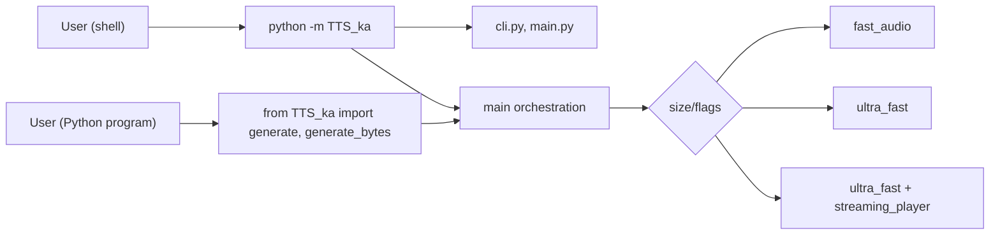
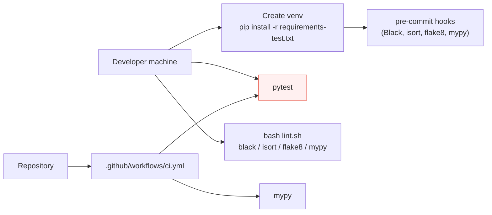

# TTS_ka Architecture & Workflows

This document contains Mermaid diagrams that map the repository structure, show how modules connect, and illustrate the primary workflows (direct generation, smart chunked generation, streaming playback, CLI and programmatic (facade) usage).

Open the diagrams on GitHub, in VS Code with Mermaid preview, or paste the Mermaid code into https://mermaid.live to render.

---

## 1) High-level module map (package structure)



Short notes:
- `facades.py` exposes simple synchronous APIs (generate, generate_bytes, stream, merge, play).
- `main.py` and `cli.py` are CLI entrypoints that call `fast_audio` or `ultra_fast` depending on input size and flags.
- `fast_audio.py` implements low-latency direct HTTP-based generation and fallback to `edge-tts`.
- `ultra_fast.py` contains chunking/parallel orchestration and uses `streaming_player.py` for streaming playback.
- `audio.py` contains basic audio utilities and play/merge helpers; `not_reading.py` sanitizes text.

---

## 2) Workflow: Direct (Ultra-fast) generation (short text)



Key points:
- Fast HTTP streaming to file via `httpx` is attempted.
- If the direct API fails, `edge-tts` fallback is used.
- `facades.generate` wraps this as a synchronous operation (calls `asyncio.run`).

---

## 3) Workflow: Smart chunked generation (long text)



Key points:
- For long input, text is split into chunks and processed in parallel.
- The `ultra_fast` orchestrator handles merging and cleanup.
- `rich_progress` may display progress during parallel generation.

---

## 4) Workflow: Streaming playback (play while generating)



Key points:
- `StreamingAudioPlayer` queues chunks and plays them as they become available.
- On Windows the first chunk often becomes the main output; other platforms can create playlists.

---

## 5) Workflow: CLI vs Programmatic (facade) usage



Notes:
- The facades present a simpler API for programmatic use and tests; they call the same internals as the CLI.
- CLI flow includes CLI parsing, help, and file/clipboard handling.

---

## 6) Developer/workflow diagram (running tests, lint, CI)



---

## Legend
- Boxes represent files or components.
- Arrows indicate call/usage or data flow.
- Colors are for visual grouping (notes highlighted boxes).

---

## How to view
- Paste any Mermaid block (between ```mermaid and ```) into https://mermaid.live/ to render.
- In VS Code, install "Markdown Preview Mermaid Support" or use built-in Mermaid rendering to preview `docs/architecture.md`.

---

If you want, I can:
- Add PNG/SVG exports of these diagrams in `docs/` so they render on platforms without Mermaid support.
- Produce a one-page printable PDF architecture sheet.
- Generate a simplified ASCII diagram for reading in terminals.

Which would you prefer next?
